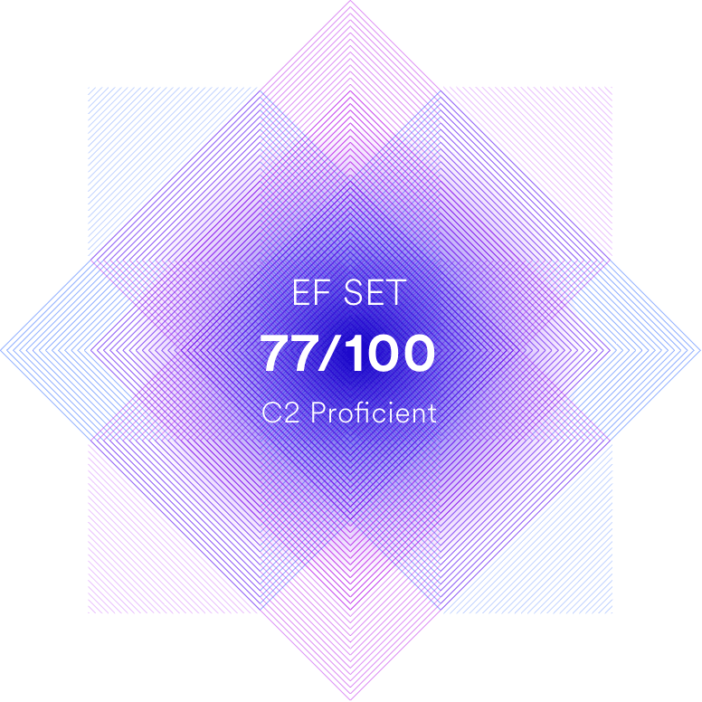

kryukov.kryukov@gmail.com
+7 (905) 285-72-73
Discord: Andrei_Kriukov#8081
	
# Andrei Kriukov

## Summary

- 6 month of studying software testing and programming 
- 10+ years experience in industrial b2b sales

## Experience

| June 2022-Present | The Rolling Scopes School | Student |
| ---- | ---- | ---- |

- Make up pages using GIT Markup and HTML
- Commit chages in GIT
- Code on JavaScript

| 2017-Present | Pruftechnik CIS, LTD | Sales Engineer |
| ---- | ---- | ---- |

- Engage with customers to promote laser alignment products
- Trained customers’ personnel, commissioned equipment

| 2013-2017 | SMC Pneumatik, LTD | Senior Sales Engineer, Team Lead |
| ---- | ---- | ---- |

- Worked with TOP clients of the department – 40% turnover
- Led a team of 7 sales engineers, 3 of them remotely

### Additionally
Organized a pop-up restaurant that served thousands of customers at events. Worked as a copywriter, an electrician.

## Education

| 2005-2010 | Saint Petersburg Mining University | Specialist. Mining Engineering, Surface Mining Operations |
| ---- | ---- | ---- |

## Courses
|      |                                        |             |
| ---- | -------------------------------------- | ----------- |
| 2022 | Introduction in programming | hexlet.io |
| 2022 | Software testing | ksendzov.com |
| 2022 | Interactive SQL Simulator | stepik.org |
| 2019 |  Data Analysis and Presentation Skills: the PwC Approach | Coursera |

## Code example
```
const length = (str) => str.length;
const toUpperCase = (str) => str.toUpperCase();

const solution = (str) => {
    let result = ""; 

    for (let i = 1; i < length(str); i++) {
            if (str[i-1] === " ") {
                result = result + toUpperCase(str[i]);
            }
            else {
                result = result + str[i];   
            }
    }
    return toUpperCase(str[0]) + result;
}
```

## Skills
Software testing, SQL, OTRS, JavaScript, HTML&CSS, GIT, Photoshop, Working in team

## English
Proficient - according to the online test at www.efset.org

